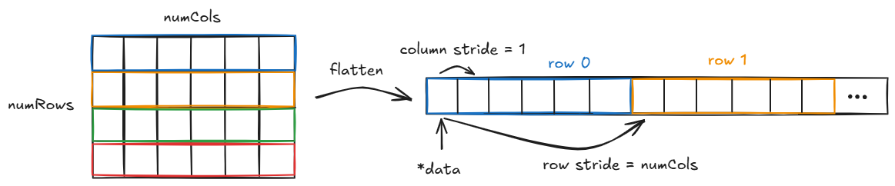

# How to multiply matrices (fast) in C

* Relevance of matrix multiplications: Machine Learning, Scientific computing (e.g. linear regression, rotations)
* Motivation:
  * Understand performance optimization of programs
  * Understand and exploit SIMD on CPU
  * Understand memory influence

## Matrix multiplication

Problem statement.
Explain how matrices are multiplied mathematically.

## Representing a matrix
For now the discussion will be restricted to matrices with a specific data type of each element, e.g. single-precision floating point numbers (float). This assumption will be relaxed after building the foundations for representing this subset of general matrices.

Since a matrix is nothing else than a collection of numbers on a 2D grid the straightfoward way for representing it in C is a 2D array.

```C
float matrix[5][8];
```

Pro:
* Indexing straight forward: matrix[rowIdx][colIdx]
* No memory management needed

Despite being very simple this approach has several limitations
* Matrix shape needs to be known at compile time
* Matrix is allocated on the stack. Since the stack size is limited this can be a constraint in the representable matrix sizes.
* No way to handle multiple data types in downstream computations

In order to avoid these drawbacks we consider a more complicated definition of a matrix. Therefore a struct is defined which will contain important meta data and most importantly a pointer to the first element of the matrix.

```C
typedef struct {
    float *data;
    size_t numRows;
    size_t numCols;
} matrix_t;
```

Let us now break down each field of the struct. The `data` field is a float pointer to the first element of a single contiguous array. In order to be able to represent a matrix by a single array we need to perform flattening. This can be done either in row-major or column-major order. Here we will only consider row-major order. Flattening a matrix in row-major order can be simply achived by concatenation of the rows like illustrated in the figure below.


The remaining fields `numRows` and `numCols` are required for bounds checks and also index calculation. In order to access an element `(i,j)` the index in the `data` array can be computed by
$$k=i * numCols + j$$

Now we need to address the second drawback of the naive matrix representation, which is allocating the memory on the stack. This can be avoided by the following matrix creation function.

```C
matrix_t createMatrix(size_t numRows, size_t numCols) {
    matrix_t matrix;
    matrix.data = malloc(numRows * numCols * sizeof(float));
    matrix.numRows = numRows;
    matrix.numCols = numCols;
    return matrix;
}
```
By using the system call `malloc` the function requests the allocation of the number of bytes required for representing a matrix with $numRows * numCols$ elements of type float. Since this allocates memory on the heap we also need to free the memory manually if the object is not needed anymore. This can be done by calling the following function.

```C
void freeMatrix(matrix_t *matrix) {
  if (matrix->data == NULL) {
    return;
  }
  free(matrix->data);
  matrix->data = NULL;
  matrix->numRows = 0;
  matrix->numCols = 0;
}
```

Now let us address the third drawback, which is that we are currently only able to represent float matrices. We start by defining an enum representing the data type.

```C
typedef enum {
  DTYPE_INT,
  DTYPE_FLOAT,
  DTYPE_DOUBLE
} MatrixDType;
```

Now we also modify the matrix struct definition by changing the float pointer to a generic void pointer and extending the struct by a field specifying the data type.

```C
typedef struct {
  void *data;
  size_t numRows;
  size_t numCols;
  MatrixDType dtype;
} matrix_t;
```

Respectively, the creation of this struct also needs to be modified.
```C
matrix_t createMatrix(size_t numRows, size_t numCols, MatrixDType dtype) {
  matrix_t matrix;
  size_t elementSize;
  switch (dtype) {
    case DTYPE_INT:
      elementSize = sizeof(int);
      break;
    case DTYPE_FLOAT:
      elementSize = sizeof(float);
      break;
    case DTYPE_DOUBLE:
      elementSoze = sizeof(double);
      break;
    default:
      matrix.data = NULL;
      // TODO: Assert here?
      return matrix;
  }
  matrix->data = malloc(numRows * numCols * elementSize);
  if (matrix->data == NULL) {
    return matrix;
  }
  matrix->numRows = numRows;
  matrix->numCols = numCols;
  return matrix;
}
```

Recall that the `sizeof()` function used here returns the number of bytes that are required to store a specific type. Finally we are able to represent matrices of different data types. But this also comes at a cost. Accessing an element of a matrix requires now to cast the void pointer first to a pointer of the respective data type. We will revisit this issues once we implement the matrix multiplication.